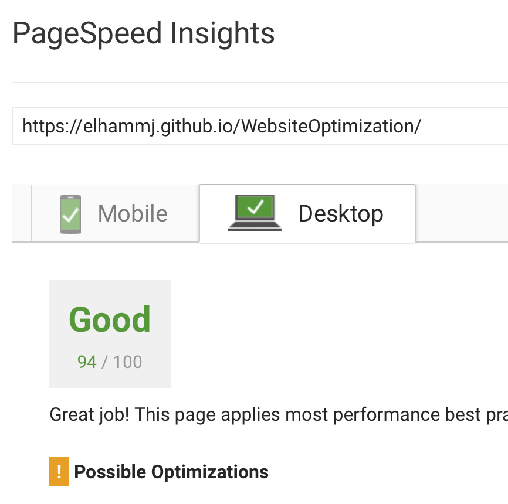
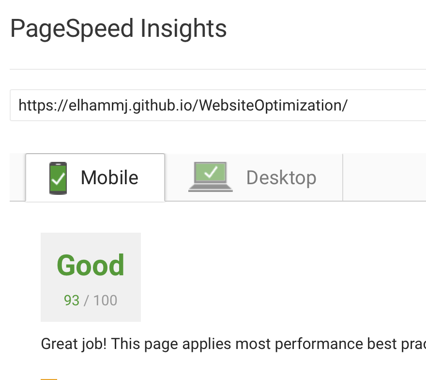

## Website Performance Optimization portfolio project

It is a challenge to optimize an online portfolio for speed! In particular, optimize the critical rendering path and make this page render as quickly as possible by applying the techniques that we have learned during the course. [Critical Rendering Path course](https://www.udacity.com/course/ud884).

### Getting started

#### Step 1: Clone or download the project. You can access the project online by visiting [https://elhammj.github.io/WebsiteOptimization/](https://elhammj.github.io/WebsiteOptimization/)

#### Step 2: Project Main Files 
 	* index.html --> is the main file that has been optimized to reach 90 above score when it is tested by pageSpeed insight tool by google. 
	* pizza.html --> is the second file that could be access from index.html. It is a fake pizza size that show some animaitons and runtime updating. In this page, the most optmizied was applied on changing the pizza size and moving random pizzas. The big challange in this part was reaching 60FPS. 
	* Other directories like css, js, img have CSS design files, images that is optimized and javascripts file to operate some functions on the pizza.html and index.html. 

### What has been optimized ? 

#### In index.html

	1- 	Render Blocking Javascript. 
	
		* Move the script part to the end of the file. 
		* Add async word to javascript external file calling (perfmatters.js) and google analytics link. 
		* Use Web Font Loader javascript to optimize google font part [webfotnloader](https://github.com/typekit/webfontloader). 
		
	2- Render Blocking CSS. 
	
		* Inline style.css
		* Add media query to the print.css link. Media=print. 
		
	3- Image Optimization. 
	
		* Download images from the external links that were provided.
		* Optimize iamges and resize them. 

The score from google PageSpeed Insight now is above 90:

### In main.js

	#####In order to reach 60FPS these steps have been applied:
	
	* Put the pizzaDiv line outside the loop to reduce the number of executing this line. 
		'var pizzasDiv = document.getElementById("randomPizzas");' 
	* Replace the querySelector to getElementByID and getSelectorAll by getElementsByClassName.
	* Optimize the calculation in updatePositions()
	
		  '''var scrollTop = document.documentElement.scrollTop || document.body.scrollTop; //In order to make it work with different browser
		  var partOfPhase = scrollTop / 1250; //calculate once outside the loop
  		  for (var j = 0; j < items.length; j++) {
    		var phase = Math.sin(partOfPhase + (j % 5));
    		items[j].style.left = items[j].basicLeft + 100 * phase + 'px';
  		  }
	* Improve number of displaying moving pizzas instead of iterating 200 times, the pizzas will be displayed depending on the screen size (height).
		'var slidPizzas = Math.round(screen.height / s) * cols;'
	* Declare elem variable once outside the loop and item variable once outside the funtion to reduce the script time. 
	
	#####In order to resize pizza in less than 5ms:
	
	* Reduce the number of using offsetWidth inside changePizzaSizes function.
	* Replace the querySelector with getElementById and querySelectorAll with getElementById.
	* Remove the determinDx function and keep the sizeSwitcher function. 

	#####Extra Work:
	
	* Inline style.css in pizza.html to optimize the script. 
	* Rearrange the project folders so now all the images under img directory, all javascript files under js directory and all CSS sheets under css directory. 
	* Use Gulp to increase the optimization. 

